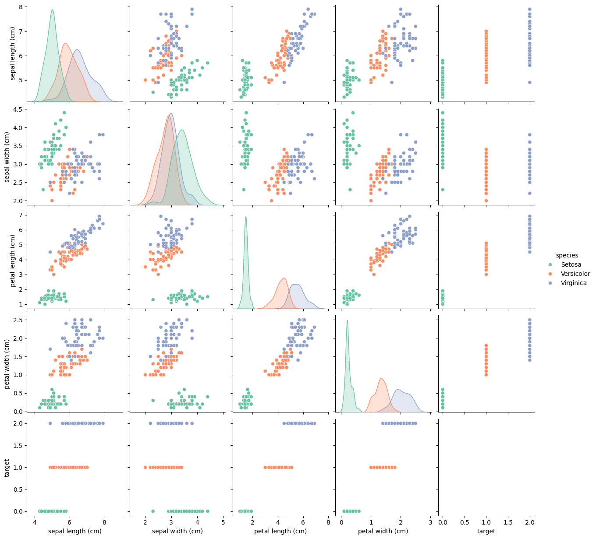
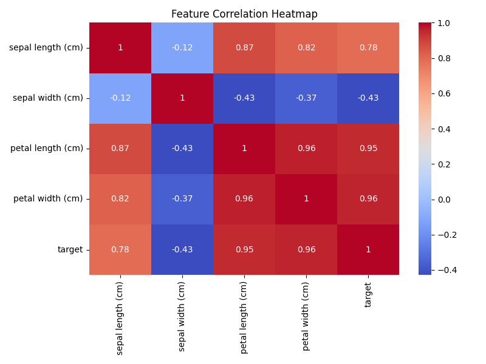
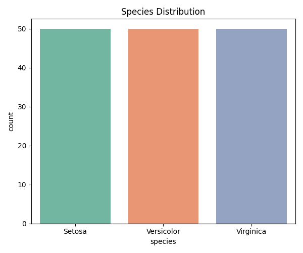
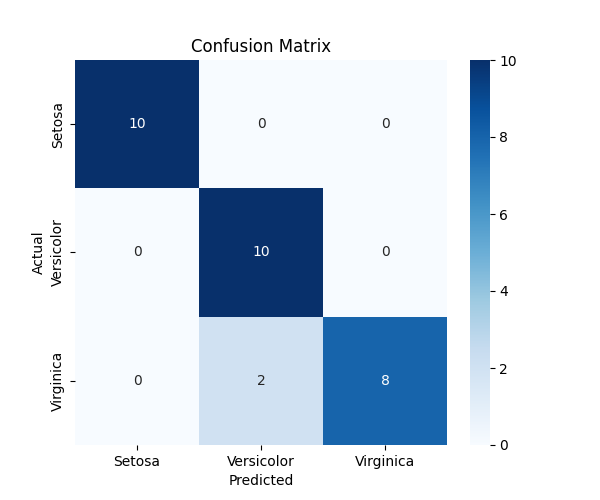

# 🌸 Iris Flower Classification using Machine Learning


A professional **Machine Learning** project that classifies **Iris flower species** using the **K-Nearest Neighbors (KNN)** algorithm. The project demonstrates the complete machine learning workflow, including data loading, preprocessing, visualization, model training, evaluation, prediction, and comparison with multiple machine learning algorithms.

Developed as part of my **Artificial Intelligence Internship at DecodeLabs**.

---

# 📌 Project Overview

The Iris Flower Classification project predicts the species of an Iris flower based on four measurements:

- Sepal Length
- Sepal Width
- Petal Length
- Petal Width

The project follows a complete end-to-end Machine Learning pipeline from loading the dataset to making predictions using a trained model.

---

# ✨ Features

- 📂 Load Iris Dataset
- 🧹 Data Preprocessing
- 📊 Data Visualization
- ✂️ Train/Test Split
- ⚖️ Feature Scaling
- 🤖 K-Nearest Neighbors (KNN) Classifier
- 💾 Save Trained Model
- 💾 Save StandardScaler
- 📈 Model Evaluation
- 📉 Confusion Matrix
- 📄 Classification Report
- 🌸 Flower Species Prediction
- 🎯 Prediction Confidence Score
- 📊 Compare Multiple Machine Learning Models
- 📁 Modular Project Structure

---

# 📂 Project Structure

```text
iris-classification-knn/
│
├── data/
│
├── models/
│   ├── knn_model.pkl
│   └── scaler.pkl
│
├── notebooks/
│
├── screenshots/
│   ├── pairplot.png
│   ├── correlation_heatmap.png
│   ├── species_distribution.png
│   ├── confusion_matrix.png
│   └── prediction_demo.png
│
├── src/
│   ├── data_loader.py
│   ├── preprocessing.py
│   ├── model.py
│   ├── evaluation.py
│   ├── predictor.py
│   ├── model_comparison.py
│   ├── visualization.py
│   └── utils.py
│
├── main.py
├── requirements.txt
├── README.md
└── LICENSE
```

---

# ⚙️ Technologies Used

- Python
- NumPy
- Pandas
- Scikit-Learn
- Matplotlib
- Seaborn
- Joblib
- Git & GitHub

---

# 🚀 Machine Learning Workflow

```
Load Dataset
      │
      ▼
Data Visualization
      │
      ▼
Data Preprocessing
      │
      ▼
Feature Scaling
      │
      ▼
Train/Test Split
      │
      ▼
KNN Model Training
      │
      ▼
Model Evaluation
      │
      ▼
Confusion Matrix
      │
      ▼
Classification Report
      │
      ▼
Flower Prediction
```

---

# 📊 Model Evaluation

The trained KNN model is evaluated using:

- Accuracy Score
- Confusion Matrix
- Classification Report
- Precision
- Recall
- F1 Score

Example Output

```text
Accuracy : 93.33%

Precision : 0.94

Recall : 0.93

F1 Score : 0.93
```

---

# 📈 Model Comparison

This project compares multiple Machine Learning algorithms.

| Algorithm | Purpose |
|-----------|---------|
| K-Nearest Neighbors | Primary Model |
| Decision Tree | Comparison |
| Random Forest | Comparison |
| Logistic Regression | Comparison |

The best-performing model is automatically displayed after evaluation.

---

# 🌸 Flower Prediction

The trained model can predict the species of a flower based on user input.

Example

```text
Sepal Length : 5.1

Sepal Width : 3.5

Petal Length : 1.4

Petal Width : 0.2

Prediction

Setosa

Confidence

100%
```

---

# 📸 Screenshots

## Pair Plot



---

## Correlation Heatmap



---

## Species Distribution



---

## Confusion Matrix



---

## Prediction Demo


---

# 🛠 Installation

Clone the repository

```bash
git clone https://github.com/okkasha009/iris-classification-knn.git
```

Go to project directory

```bash
cd iris-classification-knn
```

Install dependencies

```bash
pip install -r requirements.txt
```

Run the project

```bash
python main.py
```

---

# 🎯 Learning Outcomes

This project helped me understand:

- Supervised Learning
- K-Nearest Neighbors Algorithm
- Feature Scaling
- Data Visualization
- Model Evaluation
- Machine Learning Workflow
- Model Persistence using Joblib
- Prediction using Trained Models
- Clean Project Structure
- Git & GitHub

---

# 🚀 Future Improvements

- Hyperparameter Tuning
- Cross Validation
- Flask Web Application
- FastAPI REST API
- Streamlit Dashboard
- Deep Learning Version
- Deployment on Hugging Face Spaces
- Docker Support

---

# 👨‍💻 Author

**Okkasha Muhammad**

BS Computer Science

Artificial Intelligence Intern @ DecodeLabs

GitHub: https://github.com/okkasha009

---

# ⭐ Support

If you found this project useful, consider giving it a ⭐ on GitHub.
